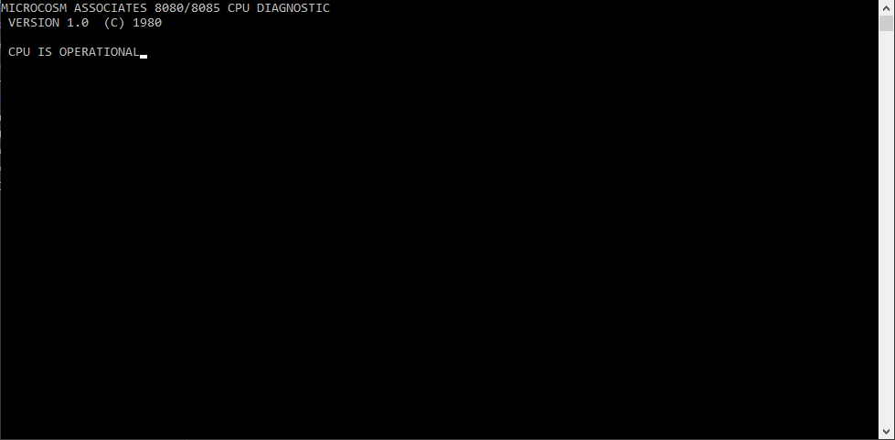

# 8080 Emulator

A 8080 microprocessor emulator that can run classic space invaders and some COM programs, I mainly chose this emulator to learn more about emulator development and low-level programming.
<br>
<br>
All 255 opcodes have been implemented and tested, also some dedicated shift hardware has been emulated as space invaders use this for moving pixels on the screen and thus adds a hardware shift register to help with the math.
<br>
<br>
As the 8080 is a microprocessor and not a complete machine like a Gameboy, it does not have a standard input or sound, only some ports that can receive and send signals.
So for sending keyboard signals I used Qt as these are not really part of emulating an 8080. For now there's no sound but emulating a sound card used in old arcade machines might be a fun project for the future.

<br>


<br>

## Controlls (Space invaders):

```
[Shift] Insert Coin
[1 - 2] Choose Player
[A]     Move Left
[D]     Move Right
[Space] Shoot
[Del]   Tilt
```
<br>

### Dissasembleing ROM's:


### Passed MICROCOSM ASSOCIATES 8080/8085 CPU DIAGNOSTIC:


### Easy debugging:


## How to install:

```
mkdir build
cd build
cmake ..
cmake --build .
```

## Sources:

http://www.emulator101.com/reference/8080-by-opcode.html<br>
https://computerarcheology.com/Arcade/SpaceInvaders/Code.html<br>
https://computerarcheology.com/Arcade/SpaceInvaders/<br>
https://computerarcheology.com/Arcade/SpaceInvaders/Hardware.html<br>
[8080-Programmers-Manual.pdf](Resources/8080-Programmers-Manual.pdf)<br>
https://en.wikipedia.org/wiki/Intel_8080<br>
